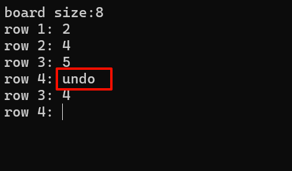
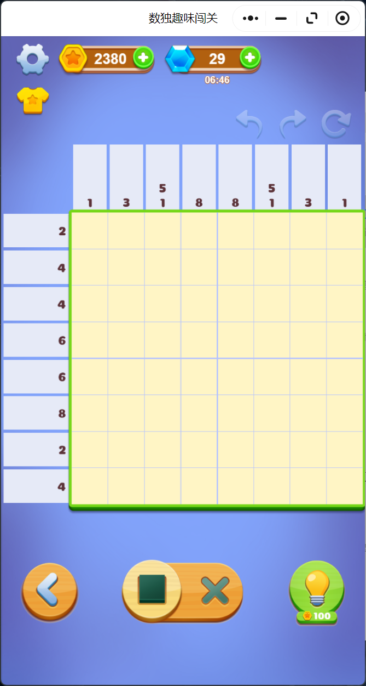
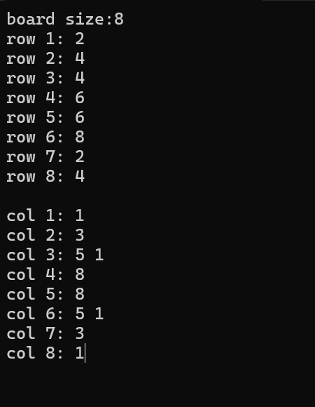
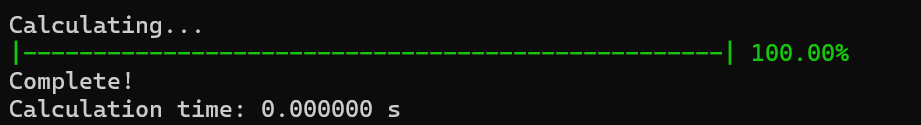
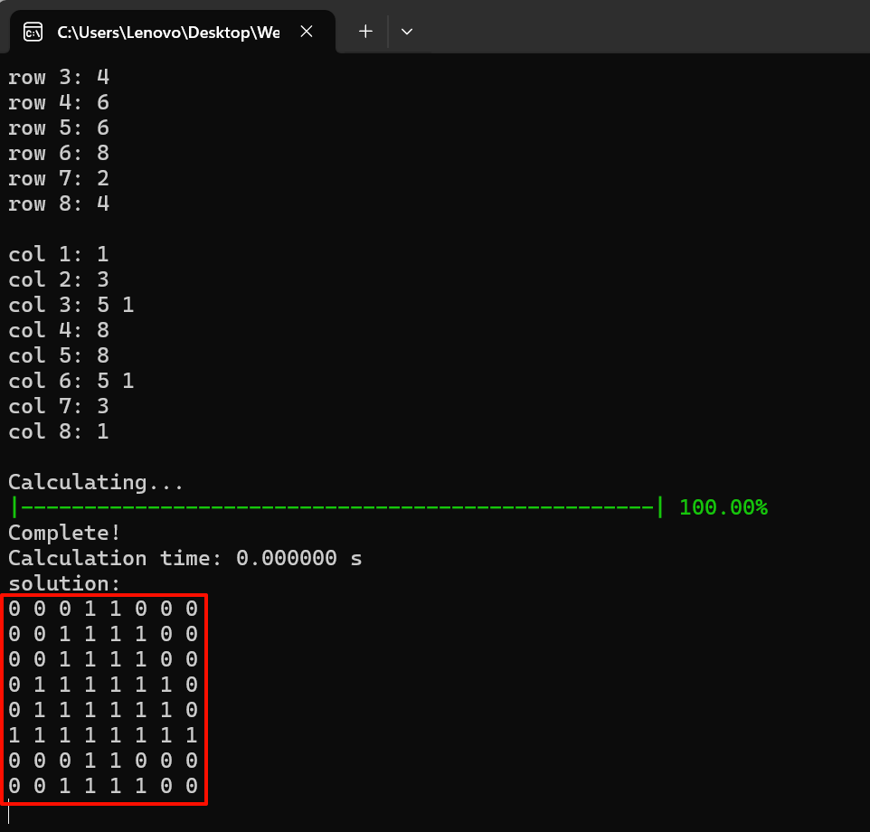
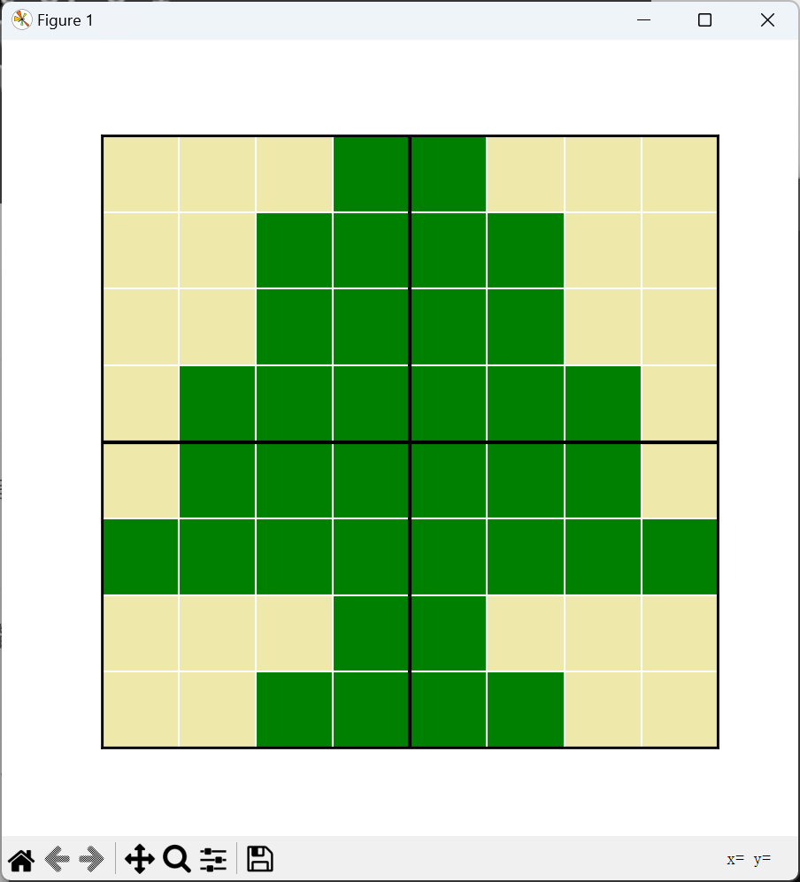

# 一、简介
此项目是专为微信小程序：**数独趣味闯关** 所设计的解题程序，基于深度优先搜索算法，采用python3.11.4实现计算和图形显示。在极短时间内（低于1秒）给出一个直观解题方案。

# 二、输入
使用控制台窗口输入。
## board size:
输入棋盘大小n，表示题目为 $n \times n$ 大小的棋盘。
## row&col：
接下来会出现每一行输入的提示，按照题面输入即可。

# 三、指令

## 3.1 undo
在输入行列的时候，如果上一行输入错误，且按下了Enter无法修改。可以输入“undo”可以撤销上次输入，重新输入上一行的内容。

## 3.2 reset
在输入行列的时候，可以输入"reset"指令来重新从头开始再输入新的一个题目。
## 3.3 exit
除了点击右上角的×之外，程序还提供了这个指令用于直接退出程序。
# 四、错误处理
本程序进行了一定的错误处理机制，防止误输入。
# 五、计算
在计算过程中，控制台会显示一个进度条，表示计算进度。计算结束后会显示计算的用时。

该程序在一般情况下计算时间都会少于1s。

# 六、结果输出
## 控制台输出
在控制台会显示用0和1表示的棋盘答案，1表示要涂色，0表示不涂色。
## 图形输出
程序还会自动生成一个图像，上面直观形象的显示了最终解决方案。

# 七、示例

## 题面示例：

## 输入示例：

## 计算时输出：

## 控制台结果输出：

## 图形输出：

